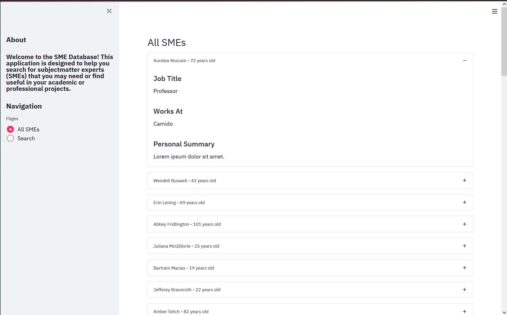

<div align="center">
  <h1>SME Database</h1>

  <h4>
    HCI 584X Project About Creating A Python Application To Allow A User To See Subject Matter Experts (SMEs) In A
    Helpful Way.
  </h4>
</div>

## Summary
This project is certainly a work-in-progress in concept, but my vision for it is to serve as a visualization tool of
sorts for finding SMEs in various fields or subject matters. I suppose for now the "data" pertaining to each SME will be
considered mock data, but I am also imagining that this will eventually come from an external database endpoint of some
kind. What I mean by this is take, for example, if Wikipedia was your "database" of people, then we could create our own
database from such an external database.

## Project Update (June 21st, 2021)
For the last several times I've worked on this project, I've been going over in my head how best to proceed with a
graphical user interface for the SME database. I decided to go with Python's built-in Tkinter library, as it is pretty
simple and straightforward to use.

I only have what is shown in the screenshot below working. That is, the base GUI and layout along with the displaying
of the mock data I created last time. I will certainly still need to implement the logic around user input, and the
resulting display of relevant data based on that input. I will also still need to brainstorm how I'm going to be
getting real live data back from some sort of internet endpoint. I'm not sure if I'll have enough time to carry the
project all the way through the way I had originally conceived, with all of this considered.

## Project Update (July 7th, 2021)

### Self Assessment
For the last several weeks, I've been going over the feedback I received and decided to switch up the platform for the
SME application from the way I originally conceived it. I'll be using, based on an in-class suggestion, to use
Streamlit. While it has been a struggle learning both the ins-and-outs of Python and Streamlit, I believe I'm making
decent progress, especially after moving away from the far simpler Tkinter.

### Major Updates
* Moving to Streamlit
* Adding more extensive mock data with more planned
* Making the application be a multi-page web app for flexibility

### Next Steps
* Flesh out the entire application, as broad as that is. I'd like to have each page of the application link to different
  parts of the app
* Implement missing features such as an actually functional search feature (shouldn't actually be hard, I think)
* Think of more features and pages to add to the application as a whole to make the whole thing seem useful and coherent

I don't believe I'll need any particular help yet:)



## IDE/Project Setup
I'll be using JetBrains' [PyCharm](https://www.jetbrains.com/pycharm/) Community Edition to develop code for this
project. I will of course be utilizing [Git](https://git-scm.com) and [GitHub](https://github.com/) for version control.

You will also need a [Python](https://www.python.org/) interpreter. I will be using the latest version (3.9.6 as of
this writing). Now, from your command line:

```bash
# I Just Create A `Scratch` Directory At The Top Level Of My OS
cd /
mkdir Scratch && cd Scratch

# Clone The Repository
git clone https://github.com/smdooley34/SME-Database.git 
```
